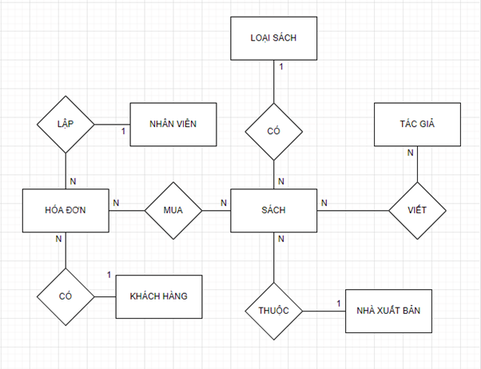
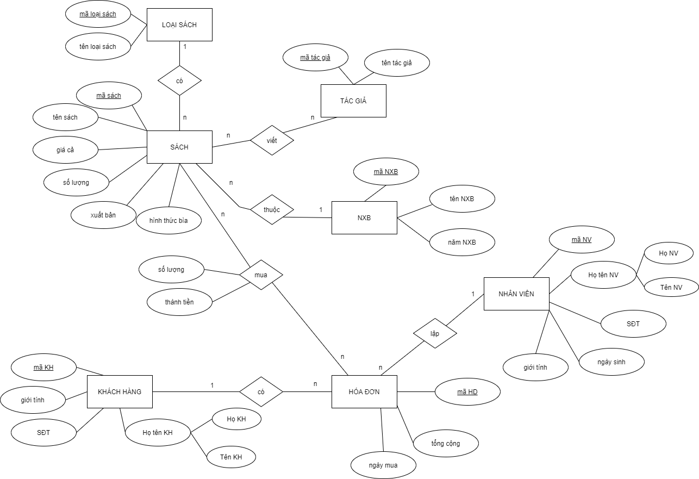

# FAHASHA Bookstore System Management
**Author:** Chau My Phuong

**Project Description**
Building a FAHASHA bookstore management system with the following main functions:
- Book management (add/edit/delete/search)
- Customer & employee management
- Order & invoice management
- Revenue statistics by month/year/book genre
- Advanced book search (author, publisher, price, genre...)

Tech stack: **MySQL** + **Draw.io**

---

# Background
FAHASA is one of the most well-known and trusted bookstore chains in Vietnam, serving families, students, and readers of all ages with a wide range of products including books, magazines, school supplies, stationery, and souvenirs. With hundreds of stores nationwide and a large-scale retail operation, FAHASA has been gradually digitizing its business processes to replace traditional paper-based management.

Currently, a significant portion of daily operations — such as inventory tracking, sales recording, customer information collection, and book catalog management — is still performed manually or semi-manually. This leads to inefficiencies in searching for books, updating stock levels, generating sales reports, and providing a seamless online shopping experience.

## Business Objectives
The primary goal of this project is to design and implement a modern, centralized database system for FAHASA with the following key objectives:
- Digitize the entire book catalog and make it available online so customers can easily search and purchase books via a website or mobile application.
- Enable customers to find books quickly using multiple criteria: title, author, publisher, genre, price range, cover type, summary, and availability.
- Provide a fast, reliable, and user-friendly system that can be used by staff of all technical levels (cashiers, warehouse team, managers) and by customers online.
- Support core business operations:
  - Inventory management (track stock quantity, incoming books from publishers)
  - Sales and invoicing (record every transaction accurately)
  - Customer management (collect and store basic customer information for loyalty and marketing purposes)
  - Employee tracking (assign responsibility for each sale)
  - Reporting & analytics (monthly revenue, best-selling genres/authors, low-stock alerts)
- Lay the foundation for future enhancements such as e-commerce integration, online payment, delivery tracking, and personalized recommendations.

By achieving these objectives, FAHASA aims to improve operational efficiency, enhance customer satisfaction, increase online and in-store sales, and strengthen its position as Vietnam’s leading modern bookstore chain in the digital era.
This database system will serve as the backbone for both physical store operations and the future FAHASA online shopping platform.

# Database design
## List of table
**Database Structure (8 Tables)**
| Table            | Purpose                              | Key Fields                              |
|------------------|--------------------------------------|-----------------------------------------|
| Books            | All book details                     | BookID (PK), Title, Price, Stock        |
| Publishers       | Publishing houses                    | PublisherID (PK), Name, Year            |
| Authors          | Book authors                         | AuthorID (PK), AuthorName               |
| Book_Author      | Many-to-many link                    | AuthorID + BookID (composite PK)        |
| Customers        | Customer info                        | CustomerID (PK), Name, Phone, Address   |
| Employees        | Staff info                           | EmployeeID (PK), Name, Phone, DOB       |
| Invoices         | Sales transactions                   | InvoiceID (PK), Date, CustomerID, EmployeeID |
| InvoiceDetails   | Items in each invoice                | InvoiceID + BookID (PK), Qty, LineTotal |

## Table design
**1. Book table**
| Field Name       | Data Type      | Width/Precision | Description                  | Notes & Constraints                                      |
|------------------|----------------|-----------------|------------------------------|----------------------------------------------------------|
| BookID           | CHAR(6)        | 6               | Book ID         | `PRIMARY KEY`                                           |
| Title            | NVARCHAR(100)  | 100             | Book title                   | NOT NULL                                              |
| GenreID          | CHAR(6)        | 6               | Genre/Category ID            | NOT NULL,  `FOREIGN KEY → Genres(GenreID)`          |
| PublisherID      | CHAR(6)        | 6               | Publisher ID                 | NOT NULL,  `FOREIGN KEY → Publishers(PublisherID)`  |
| Price            | DECIMAL(12,0)  | –               | Price (VND)                  | NOT NULL,                         |
| QuantityInStock  | INT            | –               | Stock quantity               | NOT NULL,  |
| CoverType        | NVARCHAR(30)   | 30              | Cover type                   | NOT NUL |

**2. Genres table**
| Field Name   | Data Type     | Width | Description            | Constraints                  |
|--------------|---------------|-------|------------------------|------------------------------|
| GenreID      | CHAR(6)       | 6     | Genre ID (PK)          | `PRIMARY KEY`             |
| GenreName    | NVARCHAR(50)  | 50    | Genre name             | NOT NULL                   |

**3. Authors table** 

| Field Name | Data Type | Width | Description        | Constraints   |
|------------|-----------|--------|--------------------|---------------|
| AuthorID   | CHAR      | 6      | Author ID (PK)     | `PRIMARY KEY`   |
| AuthorName | NVARCHAR  | 100    | Full name of author| NOT NULL      |

**4. Publishers table** 

| Field Name      | Data Type | Width | Description          | Constraints   |
|------------------|-----------|--------|----------------------|---------------|
| PublisherID      | CHAR      | 6      | Publisher ID (PK)    | `PRIMARY KEY`   |
| PublisherName    | NVARCHAR  | 100    | Publisher name       | NOT NULL      |
| EstablishedYear  | YEAR      | –      | Year established     |               |

**5. Employees table** 

| Field Name   | Data Type | Width | Description     | Constraints |
|--------------|-----------|--------|-----------------|-------------|
| EmployeeID   | CHAR      | 6      | Employee ID (PK)| `PRIMARY KEY` |
| FirstName    | NVARCHAR  | 10     | First name      | NOT NULL    |
| LastName     | NVARCHAR  | 50     | Last name       | NOT NULL    |
| Phone        | CHAR      | 10     | Phone number    |             |
| DateOfBirth  | DATE      | –      | Date of birth   |             |
| Gender       | NVARCHAR  | 10     | Gender          |             |

**6. Customers table**

| Field Name | Data Type | Width | Description      | Constraints |
|------------|-----------|--------|------------------|-------------|
| CustomerID | CHAR      | 6      | Customer ID (PK) | `PRIMARY KEY` |
| FirstName  | NVARCHAR  | 10     | First name       | NOT NULL    |
| LastName   | NVARCHAR  | 30     | Last name        | NOT NULL    |
| Gender     | NVARCHAR  | 5      | Gender           |             |
| Phone      | CHAR      | 10     | Phone number     |             |
| Address    | NVARCHAR  | 100    | Home address     |             |

**7. Invoices table**

| Field Name  | Data Type | Width | Description        | Constraints |
|-------------|-----------|--------|--------------------|-------------|
| InvoiceID   | CHAR      | 8      | Invoice ID (PK)    | `PRIMARY KEY` |
| CustomerID  | CHAR      | 6      | Customer ID        | FK → Customers |
| EmployeeID  | CHAR      | 6      | Employee ID        | FK → Employees |
| InvoiceDate | DATE      | –      | Purchase date      |  |
| TotalAmount | DECIMAL   | 15,0   | Total amount (VND) | NOT NULL    |

**8. InvoiceDetails table**

| Field Name | Data Type | Width | Description        | Constraints                                 |
|------------|-----------|--------|--------------------|---------------------------------------------|
| InvoiceID  | CHAR      | 8      | Invoice ID         | `PK`, `FK → Invoices`                 |
| BookID     | CHAR      | 6      | Book ID            | `PK`, `FK → Books`                    |
| Quantity   | INT       | –      | Quantity sold      | NOT NULL           |
| LineTotal  | DECIMAL   | 15,0   | Line total (VND)   | NOT NULL                                    |

# ERD diagram
## ERD diagram 

## Erd mapping

## Database schema

