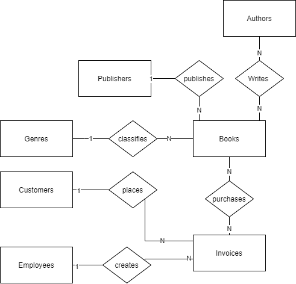
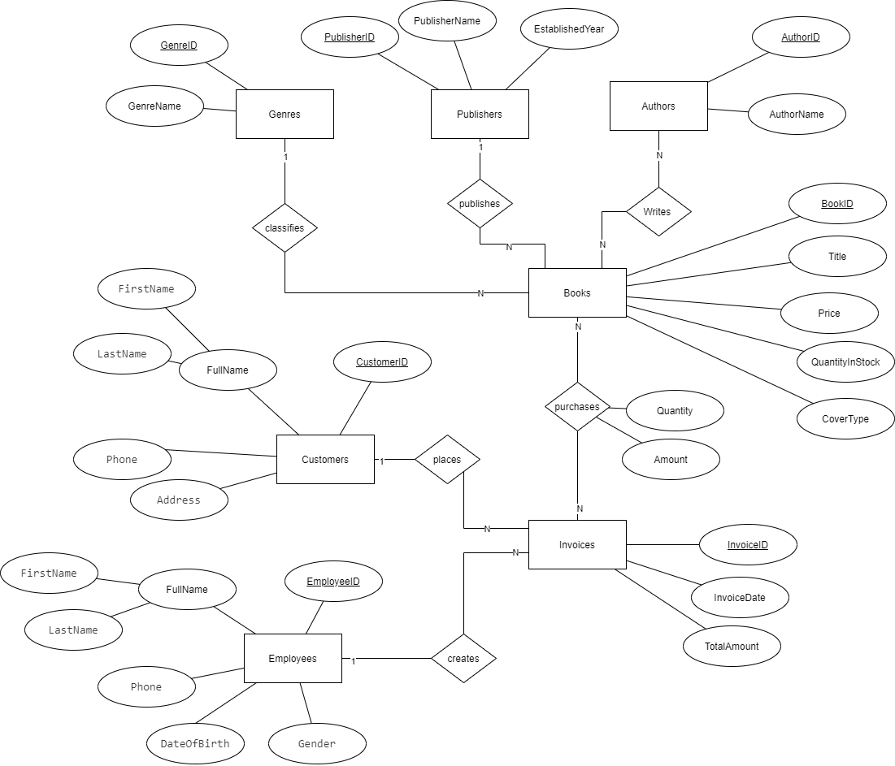
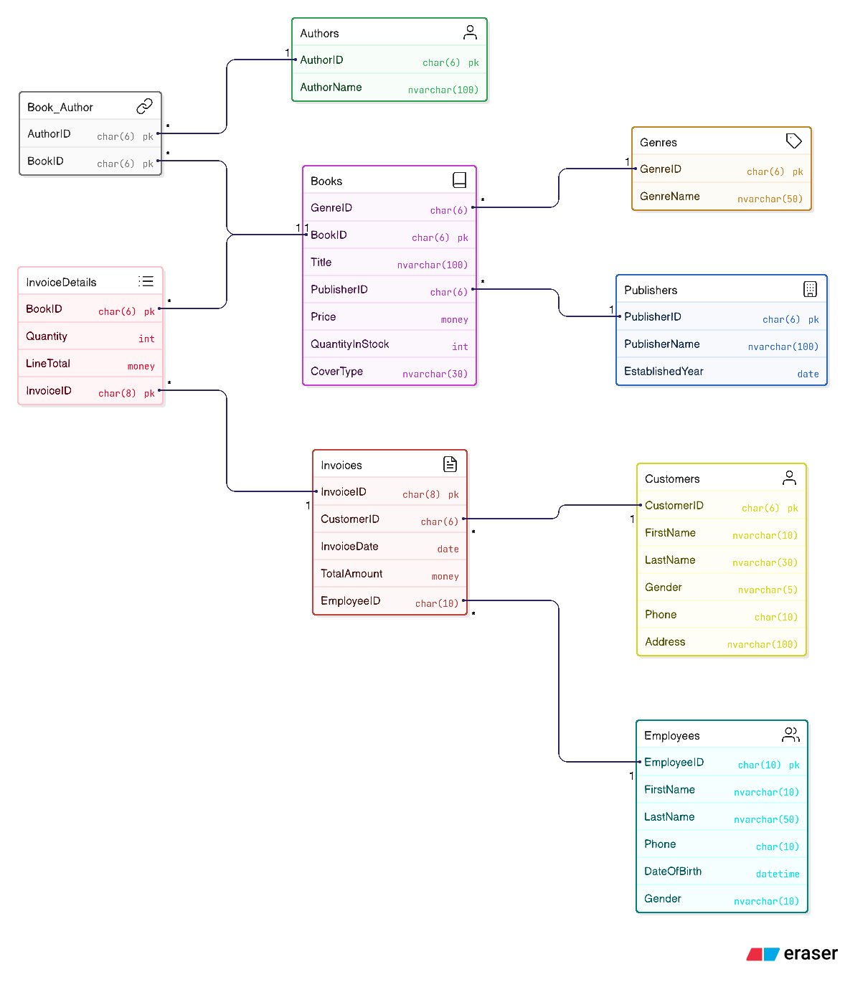

# FAHASA Bookstore System Management
**Author:** Chau My Phuong

**Date:** 28/11/2022

**Project Description**
Building a FAHASHA bookstore management system with the following main functions:
- Book management
- Customer & employee management
- Order & invoice management
- Revenue statistics by month/year/book genre
- Advanced book search (author, publisher, price, genre...)

Tech stack: **MySQL** + **Draw.io**

---

# Background
FAHASA is one of the most well-known and trusted bookstore chains in Vietnam, serving families, students, and readers of all ages with a wide range of products including books, magazines, school supplies, stationery, and souvenirs. With hundreds of stores nationwide and a large-scale retail operation, FAHASA has been gradually digitizing its business processes to replace traditional paper-based management.

Currently, a significant portion of daily operations — such as inventory tracking, sales recording, customer information collection, and book catalog management — is still performed manually or semi-manually. This leads to inefficiencies in searching for books, updating stock levels, generating sales reports, and providing a seamless online shopping experience.

## Business Objectives
The primary goal of this project is to design and implement a modern, centralized database system for FAHASA with the following key objectives:
- Digitize the entire book catalog and make it available online so customers can easily search and purchase books via a website or mobile application.
- Enable customers to find books quickly using multiple criteria: title, author, publisher, genre, price range, cover type, summary, and availability.
- Provide a fast, reliable, and user-friendly system that can be used by staff of all technical levels (cashiers, warehouse team, managers) and by customers online.
- Support core business operations:
  - Inventory management (track stock quantity, incoming books from publishers)
  - Sales and invoicing (record every transaction accurately)
  - Customer management (collect and store basic customer information for loyalty and marketing purposes)
  - Employee tracking (assign responsibility for each sale)
  - Reporting & analytics (monthly revenue, best-selling genres/authors, low-stock alerts)
- Lay the foundation for future enhancements such as e-commerce integration, online payment, delivery tracking, and personalized recommendations.

By achieving these objectives, FAHASA aims to improve operational efficiency, enhance customer satisfaction, increase online and in-store sales, and strengthen its position as Vietnam’s leading modern bookstore chain in the digital era.
This database system will serve as the backbone for both physical store operations and the future FAHASA online shopping platform.

# Database design
## List of table
**Database Structure (8 Tables)**
| Table            | Purpose                              | Key Fields                              |
|------------------|--------------------------------------|-----------------------------------------|
| Books            | All book details                     | BookID (PK), Title, Price, Stock        |
| Publishers       | Publishing houses                    | PublisherID (PK), Name, Year            |
| Authors          | Book authors                         | AuthorID (PK), AuthorName               |
| Book_Author      | Many-to-many link                    | AuthorID + BookID (composite PK)        |
| Customers        | Customer info                        | CustomerID (PK), Name, Phone, Address   |
| Employees        | Staff info                           | EmployeeID (PK), Name, Phone, DOB       |
| Invoices         | Sales transactions                   | InvoiceID (PK), Date, CustomerID, EmployeeID |
| InvoiceDetails   | Items in each invoice                | InvoiceID + BookID (PK), Qty, LineTotal |

## Table design
**1. Book table**
| Field Name       | Data Type      | Width/Precision | Description                  | Notes & Constraints                                      |
|------------------|----------------|-----------------|------------------------------|----------------------------------------------------------|
| BookID           | CHAR(6)        | 6               | Book ID         | `PRIMARY KEY`                                           |
| Title            | NVARCHAR(100)  | 100             | Book title                   | NOT NULL                                              |
| GenreID          | CHAR(6)        | 6               | Genre/Category ID            | NOT NULL, <br>`FOREIGN KEY → Genres(GenreID)`          |
| PublisherID      | CHAR(6)        | 6               | Publisher ID                 | NOT NULL, <br>`FOREIGN KEY → Publishers(PublisherID)`  |
| Price            | DECIMAL(12,0)  | –               | Price (VND)                  | NOT NULL,                         |
| QuantityInStock  | INT            | –               | Stock quantity               | NOT NULL,  |
| CoverType        | NVARCHAR(30)   | 30              | Cover type                   | NOT NUL |

**2. Genres table**
| Field Name   | Data Type     | Width | Description            | Constraints                  |
|--------------|---------------|-------|------------------------|------------------------------|
| GenreID      | CHAR(6)       | 6     | Genre ID (PK)          | `PRIMARY KEY`             |
| GenreName    | NVARCHAR(50)  | 50    | Genre name             | NOT NULL                   |

**3. Authors table** 

| Field Name | Data Type | Width | Description        | Constraints   |
|------------|-----------|--------|--------------------|---------------|
| AuthorID   | CHAR      | 6      | Author ID (PK)     | `PRIMARY KEY`   |
| AuthorName | NVARCHAR  | 100    | Full name of author| NOT NULL      |

**4. Publishers table** 

| Field Name      | Data Type | Width | Description          | Constraints   |
|------------------|-----------|--------|----------------------|---------------|
| PublisherID      | CHAR      | 6      | Publisher ID (PK)    | `PRIMARY KEY`   |
| PublisherName    | NVARCHAR  | 100    | Publisher name       | NOT NULL      |
| EstablishedYear  | YEAR      | –      | Year established     |               |

**5. Employees table** 

| Field Name   | Data Type | Width | Description     | Constraints |
|--------------|-----------|--------|-----------------|-------------|
| EmployeeID   | CHAR      | 6      | Employee ID (PK)| `PRIMARY KEY` |
| FirstName    | NVARCHAR  | 10     | First name      | NOT NULL    |
| LastName     | NVARCHAR  | 50     | Last name       | NOT NULL    |
| Phone        | CHAR      | 10     | Phone number    |             |
| DateOfBirth  | DATE      | –      | Date of birth   |             |
| Gender       | NVARCHAR  | 10     | Gender          |             |

**6. Customers table**

| Field Name | Data Type | Width | Description      | Constraints |
|------------|-----------|--------|------------------|-------------|
| CustomerID | CHAR      | 6      | Customer ID (PK) | `PRIMARY KEY` |
| FirstName  | NVARCHAR  | 10     | First name       | NOT NULL    |
| LastName   | NVARCHAR  | 30     | Last name        | NOT NULL    |
| Gender     | NVARCHAR  | 5      | Gender           |             |
| Phone      | CHAR      | 10     | Phone number     |             |
| Address    | NVARCHAR  | 100    | Home address     |             |

**7. Invoices table**

| Field Name  | Data Type | Width | Description        | Constraints |
|-------------|-----------|--------|--------------------|-------------|
| InvoiceID   | CHAR      | 8      | Invoice ID (PK)    | `PRIMARY KEY` |
| CustomerID  | CHAR      | 6      | Customer ID        | FK → Customers |
| EmployeeID  | CHAR      | 6      | Employee ID        | FK → Employees |
| InvoiceDate | DATE      | –      | Purchase date      |  |
| TotalAmount | DECIMAL   | 15,0   | Total amount (VND) | NOT NULL    |

**8. InvoiceDetails table**

| Field Name | Data Type | Width | Description        | Constraints                                 |
|------------|-----------|--------|--------------------|---------------------------------------------|
| InvoiceID  | CHAR      | 8      | Invoice ID         | `PK`, `FK → Invoices`                 |
| BookID     | CHAR      | 6      | Book ID            | `PK`, `FK → Books`                    |
| Quantity   | INT       | –      | Quantity sold      | NOT NULL           |
| LineTotal  | DECIMAL   | 15,0   | Line total (VND)   | NOT NULL                                    |

# ERD diagram
## ERD diagram 

## Erd mapping

## Database schema


## V. DATABASE IMPLEMENTATION ON SQL SERVER (English Version)

**Part 1: Create Database & Tables**

```
-- Create Database
CREATE DATABASE FAHASA_BOOKSTORE
GO
USE FAHASA_BOOKSTORE
GO

-- 1. Genres
CREATE TABLE Genres (
    GenreID     CHAR(6)      NOT NULL PRIMARY KEY,
    GenreName   NVARCHAR(50) NOT NULL
)
GO

-- 2. Authors
CREATE TABLE Authors (
    AuthorID    CHAR(6)      NOT NULL PRIMARY KEY,
    AuthorName  NVARCHAR(100) NOT NULL
)
GO

-- 3. Publishers
CREATE TABLE Publishers (
    PublisherID     CHAR(6)  NOT NULL PRIMARY KEY,
    PublisherName   NVARCHAR(100) NOT NULL,
    EstablishedYear DATE
)
GO

-- 4. Books
CREATE TABLE Books (
    BookID          CHAR(6)       NOT NULL PRIMARY KEY,
    Title           NVARCHAR(100) NOT NULL,
    GenreID         CHAR(6)       NOT NULL,
    PublisherID     CHAR(6)       NOT NULL,
    Price           MONEY         NOT NULL,
    QuantityInStock INT           NOT NULL DEFAULT 0,
    CoverType       NVARCHAR(30)  NOT NULL
)
GO

-- Add Foreign Keys for Books
ALTER TABLE Books
ADD CONSTRAINT FK_Books_Genre     FOREIGN KEY (GenreID)     REFERENCES Genres(GenreID)
ALTER TABLE Books
ADD CONSTRAINT FK_Books_Publisher FOREIGN KEY (PublisherID) REFERENCES Publishers(PublisherID)
GO

-- 5. Employees
CREATE TABLE Employees (
    EmployeeID  CHAR(10)     NOT NULL PRIMARY KEY,
    FirstName   NVARCHAR(10) NOT NULL,
    LastName    NVARCHAR(50) NOT NULL,
    Phone       CHAR(10),
    DateOfBirth DATETIME,
    Gender      NVARCHAR(10)
)
GO

-- 6. Customers
CREATE TABLE Customers (
    CustomerID  CHAR(6)      NOT NULL PRIMARY KEY,
    FirstName   NVARCHAR(10) NOT NULL,
    LastName    NVARCHAR(30) NOT NULL,
    Gender      NVARCHAR(5),
    Phone       CHAR(10),
    Address     NVARCHAR(100)
)
GO

-- 7. Invoices
CREATE TABLE Invoices (
    InvoiceID   CHAR(8)      NOT NULL PRIMARY KEY,
    CustomerID  CHAR(6)      NOT NULL,
    EmployeeID  CHAR(10)     NOT NULL,
    InvoiceDate DATE         NOT NULL DEFAULT GETDATE(),
    TotalAmount MONEY        NOT NULL
)
GO

ALTER TABLE Invoices
ADD CONSTRAINT FK_Invoices_Customer FOREIGN KEY (CustomerID) REFERENCES Customers(CustomerID)
ALTER TABLE Invoices
ADD CONSTRAINT FK_Invoices_Employee FOREIGN KEY (EmployeeID) REFERENCES Employees(EmployeeID)
GO

-- 8. Book_Author (Junction Table)
CREATE TABLE Book_Author (
    BookID   CHAR(6) NOT NULL,
    AuthorID CHAR(6) NOT NULL,
    CONSTRAINT PK_Book_Author PRIMARY KEY (BookID, AuthorID),
    CONSTRAINT FK_Book_Author_Book   FOREIGN KEY (BookID)   REFERENCES Books(BookID),
    CONSTRAINT FK_Book_Author_Author FOREIGN KEY (AuthorID) REFERENCES Authors(AuthorID)
)
GO

-- 9. InvoiceDetails
CREATE TABLE InvoiceDetails (
    BookID    CHAR(6)       NOT NULL,
    InvoiceID CHAR(8)       NOT NULL,
    Quantity  INT           NOT NULL CHECK (Quantity >= 1),
    LineTotal MONEY         NOT NULL,
    CONSTRAINT PK_InvoiceDetails PRIMARY KEY (BookID, InvoiceID),
    CONSTRAINT FK_InvoiceDetails_Book    FOREIGN KEY (BookID)    REFERENCES Books(BookID),
    CONSTRAINT FK_InvoiceDetails_Invoice FOREIGN KEY (InvoiceID) REFERENCES Invoices(InvoiceID)
)
GO
```

**Part 2: Insert Sample Data**
```
-- 1. Insert Authors
INSERT INTO Authors (AuthorID, AuthorName) VALUES
('TG001', N'Vãn Tình'),
('TG002', N'Lê Hoàng Ngọc Diễm'),
('TG003', N'Lê Chu Cầu'),
('TG004', N'Nhóm Hà Nội Tri Thức'),
('TG005', N'Tây Mông'),
('TG006', N'Vũ Điền'),
('TG007', N'Dương Thị Hoa'),
('TG008', N'Tân Di Ổ'),
('TG009', N'Dưa Hấu Hạt Tím'),
('TG010', N'Nguyễn Ngoan'),
('TG011', N'Fujiko F. Fujio'),
('TG012', N'Huy Cận'),
('TG013', N'Uông Triều'),
('TG014', N'Nguyễn Trương Quý');
GO

-- 2. Insert Genres
INSERT INTO Genres (GenreID, GenreName) VALUES
('LS1', N'Psychology'),
('LS2', N'Romance'),
('LS3', N'Comics'),
('LS4', N'Literature'),
('LS5', N'Economics'),
('LS6', N'Sci-Fi');
GO

-- 3. Insert Publishers
INSERT INTO Publishers (PublisherID, PublisherName, EstablishedYear) VALUES
('XB001', N'Dân Trí',      '2020-07-16'),
('XB002', N'Thanh Niên',   '2021-08-23'),
('XB003', N'Thế Giới',     '2021-09-08'),
('XB004', N'Lao Động',     '2019-06-05'),
('XB005', N'Kim Đồng',     '2022-08-06'),
('XB006', N'Hà Nội',       '2019-03-03'),
('XB007', N'Hội Nhà Văn',  '2020-02-02');
GO

-- 4. Insert Books
INSERT INTO Books (BookID, Title, GenreID, PublisherID, Price, QuantityInStock, CoverType) VALUES
('A001', N'Psychology of Money',                         'LS1', 'XB001', 113000, 11, N'Softcover'),
('A002', N'Jewish Wisdom on Wealth',                     'LS1', 'XB001',  88000, 22, N'Softcover'),
('A003', N'Youth: Strive to Reach Far',                  'LS3', 'XB002',  79000, 33, N'Softcover'),
('A004', N'Doraemon',                                     'LS3', 'XB005',  27500, 30, N'Hardcover'),
('A005', N'Stories of Hanoi',                             'LS4', 'XB006', 173000, 49, N'Hardcover'),
('A006', N'My Two Hands',                                'LS3', 'XB005',  61750, 60, N'Softcover'),
('A007', N'The Secret Life of Writers',                  'LS2', 'XB007', 102000, 10, N'Softcover'),
('A008', N'Big World, Small Heart',                      'LS2', 'XB003',  73000,  8, N'Softcover'),
('A009', N'Networked World',                             'LS5', 'XB001',  80000,  7, N'Hardcover'),
('A010', N'The Joy of Quitting Work',                    'LS6', 'XB004', 151000, 10, N'Softcover');
GO

-- 5. Insert Book-Author Relationships
INSERT INTO Book_Author (BookID, AuthorID) VALUES
('A001','TG001'),('A002','TG005'),('A003','TG002'),('A004','TG011'),
('A005','TG004'),('A006','TG007'),('A007','TG003'),('A008','TG006'),
('A009','TG008'),('A010','TG009');
GO

-- 6. Insert Customers
INSERT INTO Customers (CustomerID, FirstName, LastName, Gender, Phone, Address) VALUES
('KH01', N'Nguyễn Kim', N'Anh',   N'Female', '0903041456', N'8 Nguyễn Văn Tráng, District 1'),
('KH02', N'Ngô Thị',    N'Linh',  N'Female', '0901151324', N'10 Nguyễn Trãi, District 5'),
('KH03', N'Nguyễn Kim', N'Liên',  N'Female', '0907892345', N'34 Ngô Quyền, District 5'),
('KH04', N'Trần Mai',   N'Anh',   N'Female', '0904567891', N'23 Đồng Khởi, District 1'),
('KH05', N'Trần Anh',   N'Huy',   N'Male',   '0908671234', N'76 Lê Lai, District 1'),
('KH06', N'Nguyễn',     N'Quang', N'Male',   '0905678234', N'56 Võ Văn Tần, District 3'),
('KH07', N'Lê',         N'Hương', N'Female', '0908567234', N'76 Xô Viết Nghệ Tĩnh, Bình Thạnh');
GO

-- 7. Insert Employees
INSERT INTO Employees (EmployeeID, FirstName, LastName, Phone, DateOfBirth, Gender) VALUES
('NV01', N'Bùi Thị',   N'An',      '0988987632', '1998-07-15', N'Female'),
('NV02', N'Lê Nguyên', N'Trân',    '0965111987', '1998-06-07', N'Female'),
('NV03', N'Lê Quốc',   N'Anh',     '0988654890', '1996-04-13', N'Male'),
('NV04', N'Châu Mỹ',   N'Phương',  '0867177890', '1999-04-13', N'Female'),
('NV05', N'Trần Văn',  N'Long',    '0876891200', '1999-06-06', N'Male'),
('NV06', N'Nguyễn',    N'Hải',     '0789123098', '1997-09-17', N'Male'),
('NV07', N'Vũ',        N'Hải',     '0867182279', '1990-03-08', N'Male');
GO

-- 8. Insert Invoices
INSERT INTO Invoices (InvoiceID, CustomerID, EmployeeID, InvoiceDate, TotalAmount) VALUES
('HD01', 'KH01', 'NV04', '2022-06-12', 314000),
('HD02', 'KH02', 'NV03', '2022-03-24', 705000),
('HD03', 'KH06', 'NV07', '2022-05-23', 173000),
('HD04', 'KH01', 'NV03', '2022-03-02', 183000),
('HD05', 'KH03', 'NV01', '2022-04-03', 1323000),
('HD06', 'KH04', 'NV02', '2022-04-03', 181000),
('HD07', 'KH07', 'NV05', '2022-05-04',  55000),
('HD08', 'KH04', 'NV06', '2022-05-02', 1235000);
GO

-- 9. Insert Invoice Details
INSERT INTO InvoiceDetails (BookID, InvoiceID, Quantity, LineTotal) VALUES
('A001', 'HD01', 2, 226000),
('A002', 'HD01', 1,  88000),
('A002', 'HD05', 1,  88000),
('A003', 'HD02', 1,  79000),
('A003', 'HD06', 1,  79000),
('A004', 'HD04', 4, 110000),
('A004', 'HD07', 2,  55000),
('A005', 'HD02', 1, 173000),
('A005', 'HD03', 1, 173000),
('A006', 'HD05', 2, 1235000),
('A006', 'HD08', 2, 1235000),
('A007', 'HD06', 1, 102000),
('A008', 'HD04', 1,  73000),
('A010', 'HD02', 3, 453000);
GO
```

**Part 3: Sample Queries**
```
-- 1. Find customers who bought Romance books
SELECT DISTINCT c.*
FROM Customers c
JOIN Invoices i          ON c.CustomerID = i.CustomerID
JOIN InvoiceDetails id   ON i.InvoiceID = id.InvoiceID
JOIN Books b             ON id.BookID = b.BookID
JOIN Genres g            ON b.GenreID = g.GenreID
WHERE g.GenreName = N'Romance';
GO

-- 2. Find employees who sold Psychology books
SELECT DISTINCT e.*
FROM Employees e
JOIN Invoices i          ON e.EmployeeID = i.EmployeeID
JOIN InvoiceDetails id   ON i.InvoiceID = id.InvoiceID
JOIN Books b             ON id.BookID = b.BookID
JOIN Genres g            ON b.GenreID = g.GenreID
WHERE g.GenreName = N'Psychology';
GO

-- 3. Find all books purchased in May
SELECT DISTINCT b.*
FROM Books b
JOIN InvoiceDetails id   ON b.BookID = id.BookID
JOIN Invoices i          ON id.InvoiceID = i.InvoiceID
WHERE MONTH(i.InvoiceDate) = 5;
GO

-- 4. Show book titles and quantities sold in May
SELECT b.Title, id.Quantity
FROM Books b
JOIN InvoiceDetails id   ON b.BookID = id.BookID
JOIN Invoices i          ON id.InvoiceID = i.InvoiceID
WHERE MONTH(i.InvoiceDate) = 5
ORDER BY id.Quantity DESC;
GO

-- 5. Find authors who wrote Sci-Fi books
SELECT DISTINCT a.*
FROM Authors a
JOIN Book_Author ba      ON a.AuthorID = ba.AuthorID
JOIN Books b             ON ba.BookID = b.BookID
JOIN Genres g            ON b.GenreID = g.GenreID
WHERE g.GenreName = N'Sci-Fi';
GO

-- 6. Find customers who canceled their orders
-- (Note: Add a Status column to Invoices table for real implementation)
ALTER TABLE Invoices ADD Status NVARCHAR(20) DEFAULT 'Completed';
GO
-- Example query after adding Status column:
SELECT c.*
FROM Customers c
JOIN Invoices i ON c.CustomerID = i.CustomerID
WHERE i.Status = N'Canceled';
GO

-- 7. Find female customers who bought Literature books
SELECT DISTINCT c.*
FROM Customers c
JOIN Invoices i          ON c.CustomerID = i.CustomerID
JOIN InvoiceDetails id   ON i.InvoiceID = id.InvoiceID
JOIN Books b             ON id.BookID = b.BookID
JOIN Genres g            ON b.GenreID = g.GenreID
WHERE c.Gender = N'Female' AND g.GenreName = N'Literature';
GO

-- 8. Find male customers who bought Comics in May
SELECT DISTINCT c.*
FROM Customers c
JOIN Invoices i          ON c.CustomerID = i.CustomerID
JOIN InvoiceDetails id   ON i.InvoiceID = id.InvoiceID
JOIN Books b             ON id.BookID = b.BookID
JOIN Genres g            ON b.GenreID = g.GenreID
WHERE c.Gender = N'Male'
  AND g.GenreName = N'Comics'
  AND MONTH(i.InvoiceDate) = 5;
GO

-- 9. Top 5 best-selling books
SELECT TOP 5 b.Title, SUM(id.Quantity) AS TotalSold, SUM(id.LineTotal) AS Revenue
FROM Books b
JOIN InvoiceDetails id ON b.BookID = id.BookID
GROUP BY b.Title
ORDER BY TotalSold DESC;
GO

```

